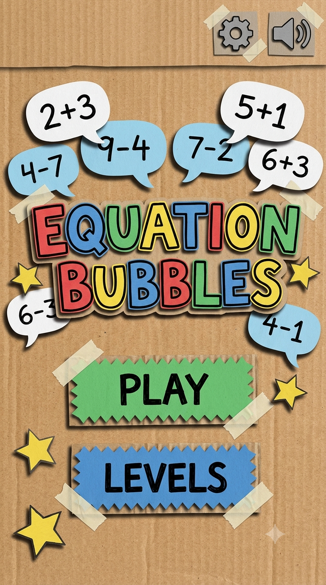
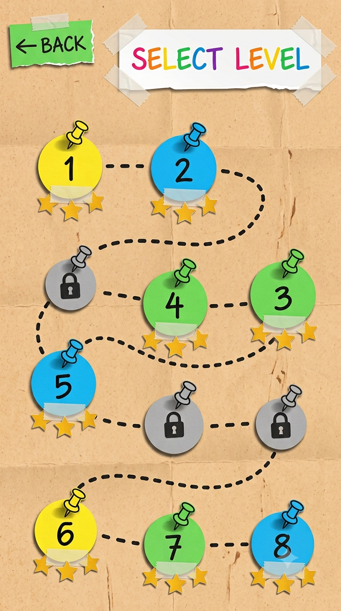
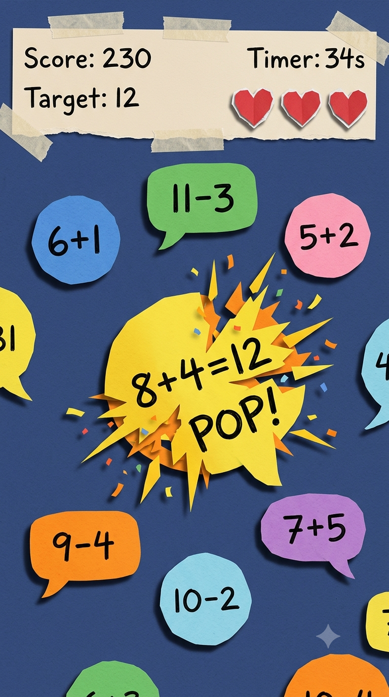
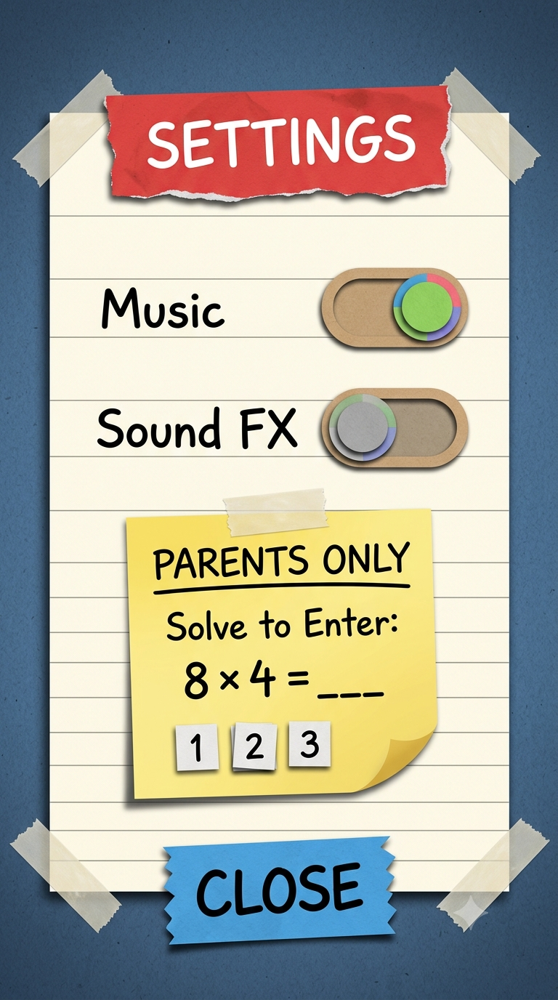
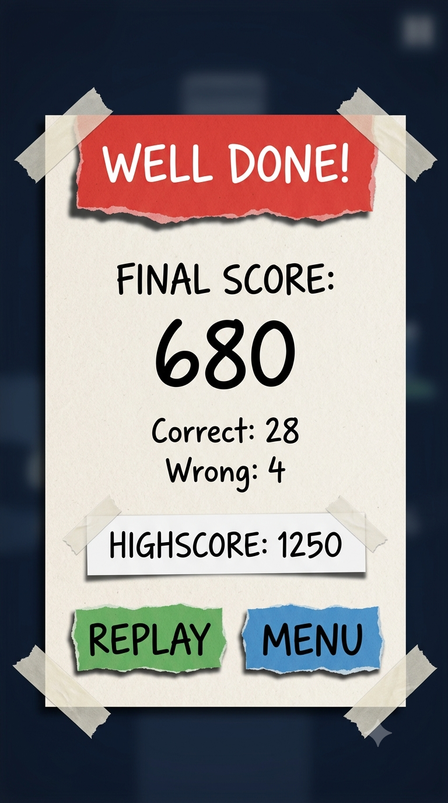

# 🫧 Equation Bubbles

<div align="center">


**A delightful, tactile procedural paper-craft educational math game for kids aged 4–10.**

[Key Features](#-key-features) • [Game Flow & Screenshots](#-game-flow--visual-style) • [100-Level Curriculum](#-100-level-curriculum) • [Architecture](#-technical-architecture) • [Getting Started](#-getting-started)

</div>

---

## 📖 Overview

**Equation Bubbles** turns foundational math practice into an engaging, tactile puzzle adventure. Players pop floating paper bubbles containing arithmetic equations that match a given target number before the timer runs out. 

Crafted with a **Scrapbook & Paper-Craft aesthetic**, every button, ribbon, pushpin, torn paper edge, and sound effect is generated **100% procedurally in code**—with zero external image or audio files!

---

## 🎨 Game Flow & Visual Style

| Main Menu Screen | Level Map & Storybook | Core Gameplay HUD |
| :---: | :---: | :---: |
|  |  |  |

| Settings & Parental Gate | Results & Victory |
| :---: | :---: |
|  |  |

---

## ✨ Key Features

- ✂️ **100% Procedural Paper-Craft Graphics:**
  - **Torn Edge Algorithm:** Perturbed vertices along polygon perimeters simulate hand-cut scissor edges.
  - **Layered Cardboard Shadows:** Multi-layered depth with offset polygons and soft alpha shading.
  - **Realistic Craft Accents:** Semi-transparent parchment tape strips, plastic & metal pushpins, dual-tone folded origami hearts, and corkboard/wood desk textures.
  - **Dynamic Confetti & Pop Starbursts:** Comic-style `"POP!"` bursts and spinning paper-shred confetti particles upon correct matches.

- 🎵 **Pure Web Audio API Synthesizer (`AudioSynth.js`):**
  - **Zero Audio Assets:** No `.mp3`, `.ogg`, or `.wav` files needed!
  - Real-time synthesis for bubble pops, cheerful bell chords, error buzzes, page turns, and an ambient pentatonic music-box soundtrack.

- 🗺️ **Cardboard Winding Trail Level Selector (`LevelSelectScene.js`):**
  - Cardboard corkboard canvas with torn paper scrap back button and taped world banners.
  - Interactive torn sticky note tabs for cycling between the 10 thematic worlds.
  - Winding dotted S-curve path with pushpins, taped badges, padlock states, and 3-star trackers.
  - Smooth touch and mouse-wheel scrolling for navigating levels.

- 🎯 **Reliable Gameplay Engine:**
  - **Target Guarantee Invariant:** Dynamic per-frame validation ensuring at least one floating bubble always matches the target number.
  - **Anti-Overlap Physics:** Pairwise circle-circle elastic repulsion algorithm preventing bubble clipping or stacking.
  - **Screen Shake & Feedback:** Tactile haptic-like visual bounces and life counter tracking.

- 🔒 **Parental Gate & Local Persistence:**
  - Settings modal with a child-resistant multiplication gate to protect sensitive actions like resetting save data.
  - High scores, 3-star ratings, and unlocked levels persist instantaneously in `localStorage`.

---

## 🗺️ 100-Level Curriculum

Ten progressive worlds carefully scaffold mathematical confidence from basic addition to multi-operation agility:

| Chapter / World | Level Range | Focus & Concepts |
|---|:---:|---|
| 🌿 **1. Starter Meadow** | 1 – 10 | Single-digit addition sums up to 10 |
| 🏔️ **2. Addition Ascent** | 11 – 20 | Teen addition and sums up to 25 |
| 🏖️ **3. Subtraction Shore** | 21 – 30 | Subtraction from numbers up to 10 |
| 🧗 **4. Subtraction Summit** | 31 – 40 | Subtraction from teens and numbers up to 25 |
| 🌄 **5. Harmony Hills** | 41 – 50 | Mixed addition and subtraction agility up to 30 |
| 🌲 **6. Multiplication Grove** | 51 – 60 | Skip counting and multiplication tables (2×, 5×, 10×) |
| ⛰️ **7. Times Table Peak** | 61 – 70 | Full 1–10 multiplication tables |
| 🌊 **8. Division Lagoon** | 71 – 80 | Fair sharing and division basics (÷ 2, 3, 5, 10) |
| 🏝️ **9. Operation Oasis** | 81 – 90 | Four-operation agility (+, −, ×, ÷) |
| 🌌 **10. Grandmaster Galaxy** | 91 – 100 | Rapid master mix across all operations up to 50 |

---

## 🏗️ Technical Architecture

```
├── screens/                    # Reference visual mockups & designs
├── src/
│   ├── audio/
│   │   └── AudioSynth.js       # Pure Web Audio API procedural sound & music engine
│   ├── game/
│   │   ├── EquationGenerator.js # 100-level formulaic math curriculum engine
│   │   └── GameState.js        # Progression, scores, stars, and localStorage persistence
│   ├── graphics/
│   │   ├── Backgrounds.js      # Wood desk, corkboard, and paper texture generators
│   │   └── PaperCraft.js       # Procedural torn polygons, tape, pins, buttons, hearts
│   ├── scenes/
│   │   ├── MainMenuScene.js    # Cardboard title screen with 3D letters & preview bubbles
│   │   ├── LevelSelectScene.js # Winding dotted path with pushpins, taped badges & world tabs
│   │   ├── GameScene.js        # Core gameplay, anti-overlap physics, pop bursts, confetti
│   │   ├── SettingsModal.js    # Audio toggles & math-based parental gate
│   │   └── ResultsModal.js     # Score sheet, star ratings, and next-level progression
│   ├── SceneManager.js         # Scene state machine and smooth transitions
│   └── main.js                 # PixiJS v8 Application bootstrap and dynamic resize
├── index.html                  # HTML entry point and web font links
├── package.json                # Project dependencies and scripts
└── vite.config.js              # Vite build configuration (if customized)
```

---

## 🚀 Getting Started

### Prerequisites
- [Node.js](https://nodejs.org/) (version 18+ recommended)
- [npm](https://www.npmjs.com/) or [pnpm](https://pnpm.io/)

### Installation

1. **Clone the repository:**
   ```bash
   git clone https://github.com/mahethekiller/Equationbubbles.git
   cd Equationbubbles
   ```

2. **Install dependencies:**
   ```bash
   npm install
   ```

3. **Start the local development server:**
   ```bash
   npm run dev
   ```
   Open `http://localhost:5173` in your browser to play!

4. **Build for production:**
   ```bash
   npm run build
   ```
   The compiled assets will be bundled into the `dist/` directory.

---

## 📱 Mobile & Tablet Readiness

The project is built with responsiveness and mobile wrapping in mind:
- **Canvas Fluidity:** Auto-resizing via `resizeTo: window` and `autoDensity: true` to seamlessly adapt to 16:9 phones and 4:3 tablets.
- **Fast Touch Input:** Event bindings use `pointerdown` and `pointerup` to eliminate touch delay.
- **Capacitor Ready:** Easily embeddable as an Android APK or iOS app via Capacitor or Cordova.

---

## 📄 License

This project is licensed under the [MIT License](LICENSE).
